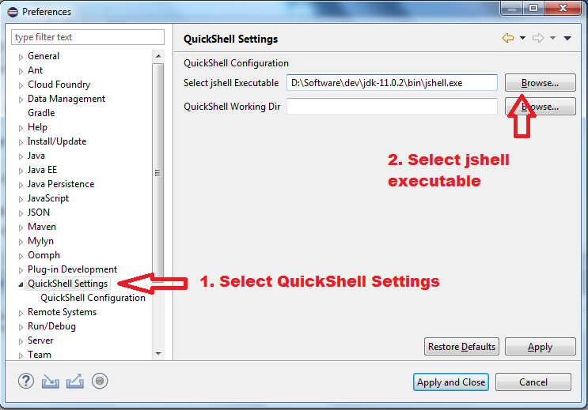
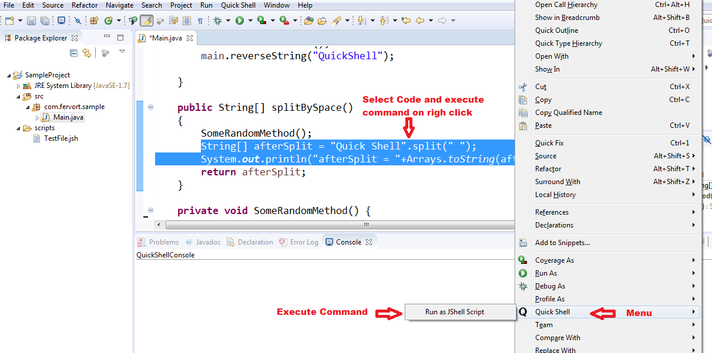
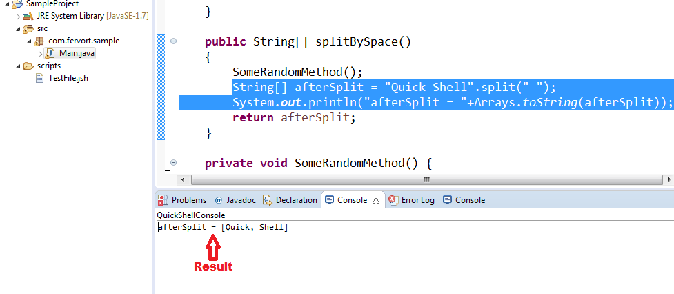
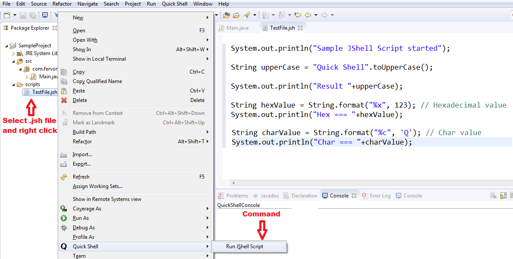
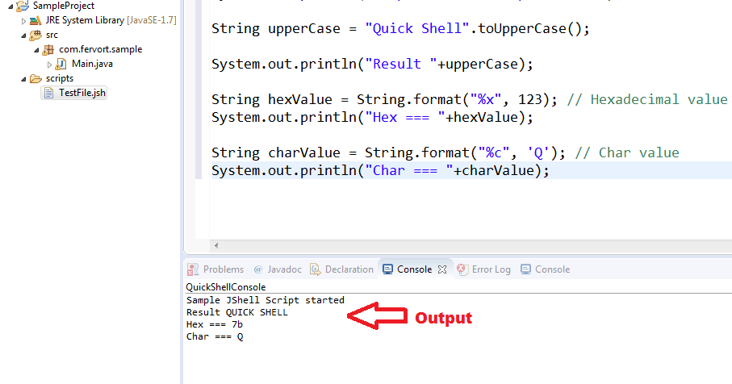
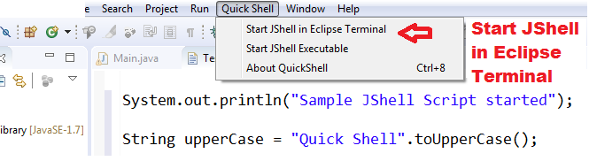
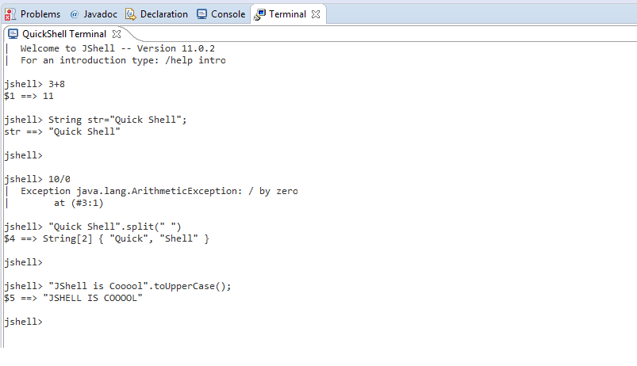
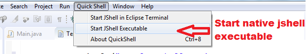
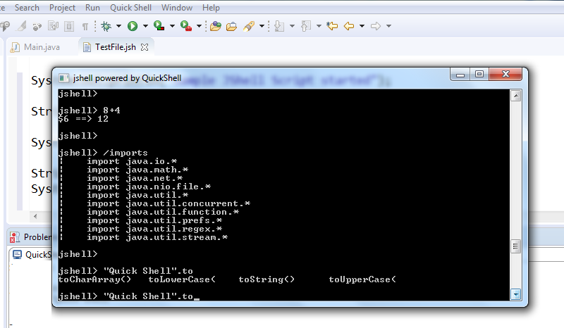

QuickShell is an Eclipse plugin to use Java JShell (REPL) inside Eclipse IDE.   
JDK 9+ is not installed on your system? No worries, you can still use QuickShell using external unzipped JDK. So without disturbing your existing project setup, you can use QuickShell. 

## How to setup :
There are multiple ways to install this plugin:

- Download from Eclipse marketplace:

- Install using Eclipse update site: 
Go to following page and follow instructions: [https://nileshkhaire.github.io/QuickShell/update/]( https://nileshkhaire.github.io/QuickShell/update/) 

- Download plugin JAR file and put into your Eclipse plugin directory "$ECLIPSE_HOME/plugins" . Restart eclipse.

> Note : QuickShell is depends on Eclipse 'TM Terminal' plugin. If it is already not install in your Eclipse (Press Ctrl+Alt+T to check) , please download from Eclipse Marketplace. Without this plugin some features of QuickShell will not work. [ Check this Question for more ]( https://stackoverflow.com/questions/43623643/how-to-open-terminal-inside-eclipse ) 

## How to configure :

- Go to Eclipse menu, Window -> Preferences -> QuickShell Settings and click on browse to select jshell executable present in JDK installation directory.(JDK 9+) ( jshell.exe in Windows). See screenshot below : 

> Note : Even though you are using older JDK for running eclipse, you can still use this plugin by using external JDK. For this you can download JDK9+ from [ https://jdk.java.net/archive/ ]( https://jdk.java.net/archive/) unzip it somewhere and select path of jshell executable in setting specified above. 

## How to use :

### 1. Java class lines as jshell script :

Select your existing code in java editor and click on right-click menu QuickShell -> Run as JShell script.

### Result

### 2. Run .jsh (jshell file) :

Create a file with extension `.jsh`. for example `test.jsh` and right-click on it and click on the pop-up menu QuickShell -> Run JShell Script. Check the screenshot below:

### Result

### 3. Start JShell in Eclipse Terminal :

Click on eclipse menu QuickShell -> Start JShell in Eclipse Terminal. This will open jshell in eclipse terminal.

### Result

### 4. Start JShell native Executable :

Click on eclipse menu QuickShell -> Start JShell Executable. This will call jshell executable in a separate window. (Note: This is a platform-dependent feature it may not be supported on your operating system or it may not work on your operating system. I have tested on Windows and it is working as expected. I am trying to support other OS in next releases. 

### Result

